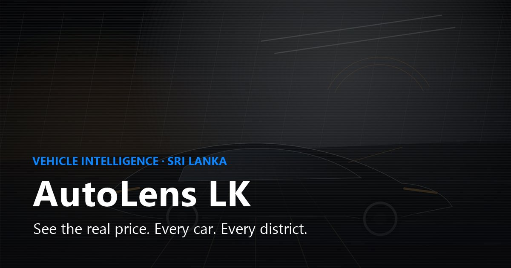
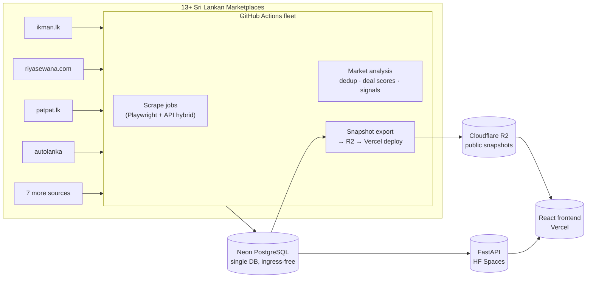

<p align="center">
  
</p>

<p align="center">
  <strong>The fair mila for every motor.</strong><br />
  Sri Lanka's vehicle price intelligence platform — every listing, every source, one honest number.
</p>

<p align="center">
  
  
  
  
  
  
  
  
</p>

<p align="center">
  <a href="https://motormila.vercel.app">🌐 Live App</a> ·
  <a href="#features">Features</a> ·
  <a href="#the-pipeline">The Pipeline</a> ·
  <a href="#architecture">Architecture</a> ·
  <a href="#quickstart">Quickstart</a> ·
  <a href="#operations">Operations</a>
</p>

---



---

## 🚗 What is Motormila?

Motormila is a **vehicle market intelligence platform for Sri Lanka**. It watches every major used-car marketplace, deduplicates the same car across sites, and turns ~180,000 live listings into clear answers:

> **What is this car actually worth today?** · Is it a good deal, or a trap? · Which districts move fastest? · Is the market going up or down — and where?

Think Bloomberg terminal for the Sri Lankan second-hand car market — but free to browse, obsessive about fairness, and built on real listing data refreshed multiple times a day.

### The problem it solves

Sri Lanka's car market is fragmented across a dozen+ marketplaces with wildly different formats, currencies (LKR vs USD), duplicate postings, and no price history. Buyers guess. Sellers guess. Dealers hedge.

Motormila fixes that with one obsessive idea: **watch everything, deduplicate ruthlessly, price honestly.**

- **13+ sources scraped** — ikman, riyasewana, patpat, autolanka, autodirect, saleme, riyahub, dimo, hitad, cartivate, and more
- **~180,000 listings tracked** with price history, not just snapshots
- **Same car across sites merged** via VIN + multi-signal fuzzy matching — one canonical record, not five duplicates
- **Refreshed 2× a day** (plus midday top-source refreshes) by an autonomous GitHub Actions fleet

---

## ✨ Features

### 📊 Market Intelligence
| | |
|---|---|
| **Live Market Snapshot** | Real-time SSE stream of market moves as scrapes land (`/stats/live/stream`) |
| **Price Trends & Index** | Price trend series per make/model — see where a car's value is heading |
| **District Intelligence** | Price maps + **district velocity** — where cars sell fastest |
| **Dashboard Insights** | Auto-generated market signals, curated daily by the analysis pipeline |

### 💰 Valuation & Deals
| | |
|---|---|
| **Fair Market Value (FMV)** | Per-listing valuation built from comparable live listings |
| **Deal Score** | Every listing scored — spot underpriced gems and overpriced traps |
| **Best Picks** | A daily shortlist of the sharpest deals on the market |
| **Price Drop Alerts** | Get pinged when a watched car drops — thresholds, % moves, and more |

### 🧭 Deep Research
| | |
|---|---|
| **Make & Model Hubs** | `/cars/toyota/axio` — full market profile per car, per model |
| **Listing History** | Per-listing price timeline, seller trust profile, similar cars |
| **Compare Tool** | Side-by-side listings, spec sheets, and valuation |
| **EV Hub** | Electric & hybrid market coverage, incl. hybrid tax trends |
| **Official Pulse** | Import permits, official sources, and policy pulse in one place |
| **Price Index** | A Bloomberg-style index of the whole SL used-car market |

### 👑 Pro & Platform
| | |
|---|---|
| **Pro Workspace** | Vehicle lanes, district deep-dives, **arbitrage gap detection** |
| **Dealer Dashboard** | Fleet-level view for dealers & resellers |
| **Invite-only Auth** | Plan-gated access, JWT sessions with instant revocation |
| **Admin Console** | Invite users, assign Free/Pro plans, manage access |

### 📱 Mobile
A companion **Expo / React Native app** (`mobile/`) with biometric unlock, camera capture, location-aware search, and push notifications.

---

## 🕸️ The Pipeline

Everything is automated. Nobody touches a database.



**The egress-first rule:** scrapers *write* to Neon (free ingress); the public site *reads* from R2 snapshots, so database egress stays flat even with ~180k listings. Full catalog snapshots refresh weekly; stats-only snapshots refresh every scrape.

| Workflow | Cadence | Job |
|---|---|---|
| **Unified Vehicle Scraper** | 02:00 & 12:40 UTC | All 13 sources → analysis → export |
| **Midday Top Sources** | 06:30 UTC | ikman + riyasewana refresh |
| **Weekly Full-Catalog Refresh** | Weekly | Full snapshot rebuild |
| **DB Backup** | Daily / emergency | Neon backups |
| **Pipeline Monitor + Keep-Alive** | Continuous | Health + HF Space warm-up |

---

## 🧱 Architecture

| Layer | Tech | Where |
|---|---|---|
| **Frontend** | React 18 · Vite · TypeScript · Tailwind · React Query · Recharts · Leaflet · framer-motion | Vercel |
| **Backend** | FastAPI · SQLAlchemy · APScheduler · structlog · Playwright | HF Spaces |
| **Database** | PostgreSQL (Neon, single-DB) · SQLite fallback for local dev | Neon |
| **Snapshots** | JSON snapshots + manifest → Cloudflare R2 → Vercel deploy | R2 |
| **Scrapers** | Python + Playwright (API-first, browser fallback), per-source isolation | GitHub Actions |
| **Mobile** | Expo · React Native · expo-router · secure-store · biometrics | `mobile/` |
| **Quality** | Vitest · Testing Library · vitest-axe · ESLint · GitHub Actions CI | CI |

```
.
├── src/            # React frontend (pages, components, services, lib)
├── backend/        # FastAPI app, scrapers, services, db models
│   ├── app/scrapers/   # 13+ per-source scraper modules
│   ├── app/services/   # market signals, aggregator, stats cache
│   └── db/             # SQLAlchemy models + session config
├── mobile/         # Expo / React Native companion app
├── api/            # (edge helpers)
├── scripts/        # ops tooling (snapshot deploy, auth bootstrap)
├── .github/workflows/  # scrape fleet, CI, backups, monitors
└── docs/           # architecture & design docs
```

---

## ⚡ Quickstart

### Prerequisites
- Node 20+ · Python 3.12 · (optional) Expo Go for mobile

### 1 · Frontend

```bash
npm install
npm run dev            # → http://localhost:8080 (proxies /api → 127.0.0.1:8000)
```

### 2 · Backend

```bash
cd backend
python -m venv .venv && source .venv/bin/activate   # Windows: .venv\Scripts\activate
pip install -r requirements.txt
# local dev needs no Neon — SQLite fallback is fine:
ALLOW_SQLITE_FALLBACK=true \
PRO_ACCESS_ENFORCED=false APP_ACCESS_ENFORCED=false \
.venv/bin/uvicorn app.main:app --reload --host 127.0.0.1 --port 8000
```

> The SQLite DB starts **empty** — scrapers hit live external sites, so expect zeroes until a run lands. Insert rows into `car_listings` to demo the UI, or run a scrape:
> ```bash
> RUN_SCRAPERS=true SCRAPE_ENABLED_SOURCES=ikman python run_sync.py
> ```

### 3 · Mobile

```bash
cd mobile
npm install
npm run start          # Expo dev server
```

### Verify

```bash
npm run typecheck && npm run lint && npm run test && npm run build   # frontend
cd backend && .venv/bin/python -m pytest tests                       # backend
```

---

## 🔐 Auth & Pro Platform (production)

Platform access is invite-only. Bootstrap an admin, then invite users from `/admin`:

```bash
python scripts/bootstrap_platform_auth.py --email you@example.com --password '…' --name 'Owner'
```

- Set `AUTH_TOKEN_SECRET` + `AUTH_USERS` on the **HF Space secrets** and `VITE_ENABLE_BACKEND_AUTH=true` on **Vercel**
- Sessions re-check plan/role/active from the DB on every gated request; `token_version` kills old JWTs instantly
- Optional: `RESEND_API_KEY` (email invites) · `BILLING_WEBHOOK_SECRET` (Stripe/PayHere plan upgrades) · `PUBLIC_APP_ORIGIN`
- Local dev: `PRO_ACCESS_ENFORCED=false APP_ACCESS_ENFORCED=false` opts out of gating

---

## 🚀 Deploying

- **Backend → HF Spaces:** pushed automatically by `.github/workflows/deploy-hf-backend.yml`; verify with `curl https://seo292-vehicle-platform-backend.hf.space/health`
- **Frontend → Vercel:** Git integration on `main`; `vercel.json` rewrites `/api/v1/*` to the HF Space (same-origin, no CORS headaches)
- **Data → Vercel:** snapshots are exported and deployed to production by the scrape pipeline itself

> ⚠️ **Vercel requires verified commits** — unsigned commits get deployments cancelled. Use SSH/GPG signing, or land commits via GitHub's web UI / PR merge (GitHub signs those automatically).

---

## 🧪 Quality & Accessibility

- **WCAG 2.2 AA** — axe-core reports **zero violations** on key pages; enforced by tests (`vitest-axe`)
- **60+ component/unit tests** across dashboard, alerts, pricing gates, search, and accessibility
- **CI** runs frontend typecheck + lint + test + build and backend `pytest` on every push/PR
- **Error boundaries** everywhere — no silent blank screens
- **Sentry** error tracking + Vercel Analytics on the live site

---

## 🗺️ Roadmap

- [x] 13+ sources live, ~180k listings, VIN + fuzzy dedup
- [x] Valuation (FMV), deal scores, price alerts, district velocity
- [x] Pro workspace: vehicle lanes, district profiles, arbitrage gaps
- [x] Mobile companion app (Expo)
- [ ] 50+ sources (see `SCRAPER_ARCHITECTURE.md`)
- [ ] LLM extraction for unstructured listing descriptions
- [ ] Adaptive per-source scheduling based on market turnover
- [ ] Historical price analytics & forecasting

---

## 📚 Docs

| Doc | What it covers |
|---|---|
| [`SCRAPER_ARCHITECTURE.md`](SCRAPER_ARCHITECTURE.md) | Scaling to 50+ sources, proxies, resilience |
| [`docs/neon-egress-budget.md`](docs/neon-egress-budget.md) | Egress budget & snapshot strategy |
| [`docs/MASTER PLAN FOR FUTURE OF MOTORMILA.txt`](docs/MASTER%20PLAN%20FOR%20FUTURE%20OF%20MOTORMILA.txt) | The long game |
| `docs/mobile-*.md` | Mobile app architecture & quickstart |

---

<p align="center">
  Built with obsession in Sri Lanka 🇱🇰<br />
  <sub>Data is for intelligence, not for flipping the market — use the fair mila wisely.</sub>
</p>
